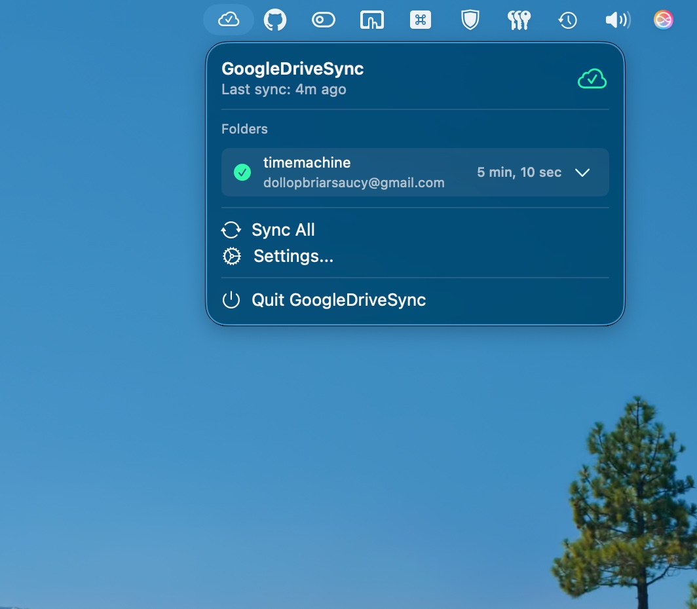

# GoogleDriveSync

A native macOS menu bar app for syncing local folders with Google Drive using rclone.

<p align="center">
  <table>
    <tr>
      <td></td>
      <td></td>
    </tr>
    <tr>
      <td></td>
      <td></td>
    </tr>
  </table>
</p>

## Features

- **Zero-Dependency Setup** - Comes with `rclone` bundled, no manual installation needed.
- **Menu Bar Integration** - Lives in your menu bar for quick access.
- **Multiple Folder Sync** - Sync as many local folders to Google Drive as you want.
- **Smart Path Resolution** - Automatically handles macOS mount point changes (e.g., finding `/Volumes/Drive-1` if `/Volumes/Drive` is stuck).
- **Multiple Google Accounts** - Works with multiple rclone-configured Google Drive remotes.
- **Automatic Sync** - Configurable sync intervals (manual, 15min, 30min, 1hr, 4hr, daily).
- **Auto-Update** - Automatically checks for new releases on launch.
- **Detailed Error Reporting** - Inspect sync errors directly from the UI.

## Requirements

- macOS 14.0 or later
- Configured Google Drive remote (via bundled or system rclone)

## Installation

### 1. Build & Run

1. Open `GoogleDriveSync.xcodeproj` in Xcode.
2. Build and run (⌘R).
3. The app will launch in your menu bar.

### 2. Configure Google Drive Remote

The app uses `rclone` under the hood. If you haven't set up a Google Drive remote yet, you can do so easily. The app respects your existing `~/.config/rclone/rclone.conf`.

If you need to create a new config:

```bash
# You can use your system rclone or the one inside the app bundle
rclone config
```

Follow the prompts to:
1. Create a new remote (choose `n`).
2. Name it (e.g., `personal-drive`).
3. Select `drive` (Google Drive) as the storage type.
4. Complete the browser authentication.

## Usage

1. Click the cloud icon in your menu bar.
2. Go to **Settings** -> **Add Folder**.
3. **Select Local Folder**: Choose the folder on your Mac you want to upload.
4. **Select Account**: Choose your Google Drive remote.
5. **Destination Folder**:
   - Leave empty to sync to the root of your Drive.
   - Or type a folder name (e.g., `Backups/Mac`) to keep things organized.
6. Click **Add**.

### Syncing

- **Sync All**: Runs sync for all configured folders.
- **Individual Sync**: Click the `⌄` dropdown on any folder and select **Sync Now**.
- **Progress**: Real-time progress and speed stats are shown in the menu.

### Troubleshooting

- **Red Triangle Icon**: If a sync fails, click the red warning icon in Settings to see the exact error message from rclone.
- **Smart Paths**: If you are syncing an external drive and it gets remounted as `Drive-1`, the app will automatically find it and continue syncing without error.

## License

MIT
