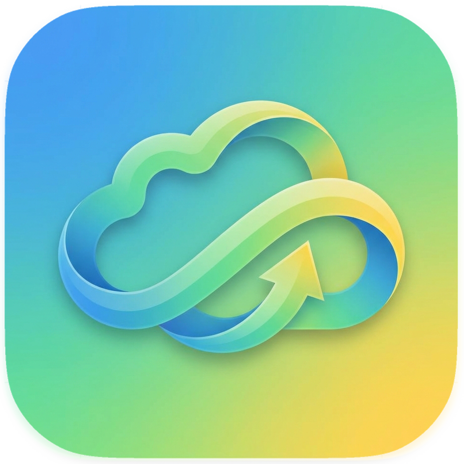
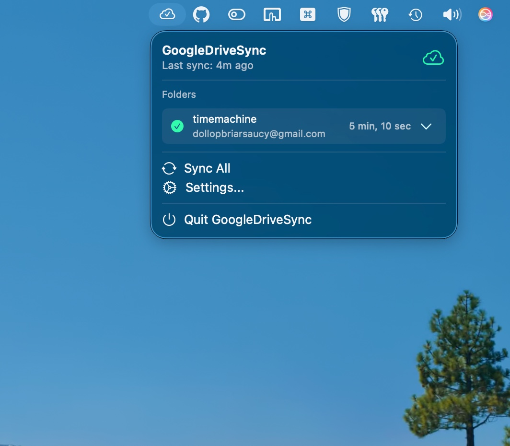
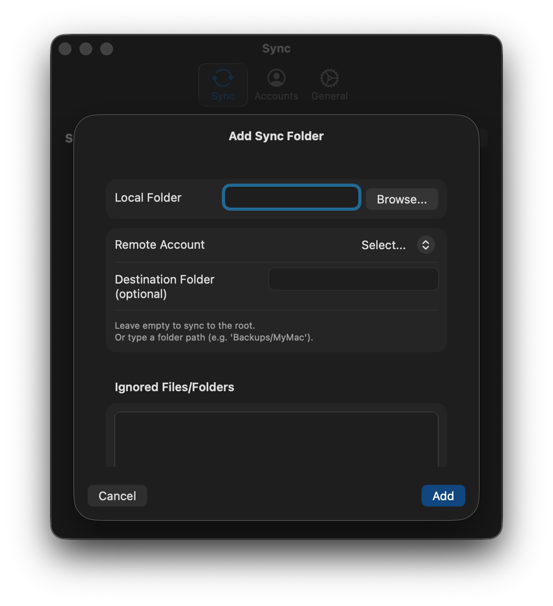

<h1>
  GoogleDriveSync
  
</h1>

**A native macOS menu bar app for seamless Google Drive syncing**

GoogleDriveSync brings Google Drive syncing to your Mac the way it should be. Simple, reliable, and living right in your menu bar. No complex setup, no external dependencies, just sync your folders..

<p align="center">
  
</p>

<p align="center">
  
  
</p>

<p align="center">
  
  
</p>

## Why GoogleDriveSync?

### Lightweight and Efficient
At just ~80MB (including the sync engine), GoogleDriveSync is 10x smaller than the official Google Drive app (~800MB). No bloat, no unnecessary background processes. Just the syncing you need.

### Multiple Google Accounts, One Simple Interface
Sync folders across multiple Google Drive accounts without juggling credentials or switching profiles. Perfect for keeping work and personal files separate, or managing multiple clients.

### Built for macOS
This isn't a cross-platform afterthought. It's a native Mac app designed to work the way Mac apps should. Lives in your menu bar, handles volume remounts gracefully, and just works.

### Zero Configuration
No daemons to configure, no config files to edit, no terminal commands to memorize. Install, authorize, pick your folders, done.

## Features

- **Flexible Folder Syncing**: Sync as many local folders as you need to any path on Google Drive. Mix and match accounts and destinations however you want.

- **Multiple Google Accounts**: Add and manage multiple Google Drive accounts simultaneously. Each folder can sync to a different account.

- **Smart Syncing**: Powered by rclone for reliable, efficient transfers. Set automatic sync intervals from 15 minutes to daily, or trigger manual syncs whenever you need.

- **Handles the Quirks**: Automatically detects when macOS remounts external volumes with different names (like `/Volumes/Drive` → `/Volumes/Drive-1`) and keeps syncing without missing a beat.

- **Real-Time Feedback**: Watch your sync progress live with transfer speeds, file counts, and completion status. Full error reporting when something goes wrong.

- **Filtering Support**: Exclude specific files and directories from syncing using simple ignore patterns. 
  - Add patterns in the *Add/Edit Sync Folder* settings menu.
  - Matches syntax loosely based on `.gitignore` (e.g., `node_modules`, `*.tmp`, `.build/`).

- **Native Architecture Builds**: Optimized builds are available for both Apple Silicon (M1/M2/M3) and Intel-based Macs natively.

- **Auto Updates**: Checks for updates on launch so you're always running the latest version.

## Requirements

- macOS 14.0 or later (Intel or Apple Silicon)
- Google Drive account(s)

## Installation

### Option 1: Download (Recommended)

Head to the [Releases page](https://github.com/saihgupr/GoogleDriveSync/releases) and grab the latest version. Download the version for your Mac's architecture (**Apple Silicon** or **Intel**). Launch it and you're ready to go. Updates happen automatically from then on.

### Option 2: Build from Source

If you want to build it yourself:

1. Clone this repo
2. Open `GoogleDriveSync.xcodeproj` in Xcode
3. Hit `⌘R` to build and run
4. The app appears in your menu bar

### 🛡️ Security & Gatekeeper

Since this is a personal project and is not currently signed or notarized by Apple, you will see a security warning when you first try to open the app.

### Troubleshooting "App is damaged" Errors

Sometimes, macOS might report that the app is "damaged" and should be moved to the bin. This is usually just Gatekeeper being overly protective of unsigned apps downloaded from the internet.

**To fix this, run the following command in Terminal:**

```bash
xattr -cr /Applications/GoogleDriveSync.app
```
*(Note: Adjust the path if you haven't moved the app to your Applications folder yet.)*

### To open the app normally:

1. **Right-click** (or Control-click) `GoogleDriveSync.app` in your Applications folder.
2. Select **Open** from the menu.
3. Click **Open** again in the dialog box that appears.

Alternatively, you can go to **System Settings** → **Privacy & Security** and click **Open Anyway** at the bottom of the page.

## Getting Started

### Setting Up Google Drive

First time running GoogleDriveSync? You'll need to authorize access to your Google Drive account(s).

1. Click the cloud icon in your menu bar
2. If no accounts are set up, you'll see a prompt to get started
3. Follow the terminal-based authorization flow to connect your Google account
4. Repeat for any additional accounts you want to add

### Adding Folders to Sync

1. Click the menu bar icon
2. Open **Settings** → **Add Folder**
3. Choose a **Local Folder** you want to sync
4. Pick which **Google Drive Account** to use
5. Set your **Destination Folder** on Drive:
   - Leave it blank to sync to the root of your Drive
   - Or specify a path like `Backups/Mac` or `Projects/2026`
6. (Optional) Enter any **Ignored Files/Folders** patterns you want to exclude.
7. Click **Add** and you're done.

### Understanding Ignore Patterns

GoogleDriveSync uses rclone's filtering system to exclude files and directories. Each line in the "Ignored Files/Folders" box represents one exclusion rule.

**Common Examples:**

- **Exclude a folder and everything inside it:**
  `node_modules/**` (This ignores the `node_modules` directory and all its contents)
  `.git/**` (Ignores your local git history)

- **Exclude specific file types:**
  `*.tmp` (Ignores all files ending in `.tmp`)
  `*.log` (Ignores log files)
  `DS_Store` (Ignores macOS folder metadata)

- **Exclude files starting with a prefix:**
  `~*` (Often used to ignore temporary office documents)

- **Multiple patterns:**
  Simply put each pattern on its own line:
  ```text
  node_modules/**
  .git/**
  *.tmp
  DS_Store
  ```

> [!TIP]
> Patterns are relative to the root of your sync folder. If you want to ignore a `build` folder that sits in the root, use `build/**`. If you want to ignore any folder named `tmp` anywhere in the directory tree, use `**/tmp/**`.


## Using GoogleDriveSync

**Sync Everything**: Click **Sync All** from the menu bar to run a sync across all your configured folders.

**Sync Individual Folders**: Use the dropdown `⌄` next to any folder and select **Sync Now** to sync just that one.

**Watch It Happen**: The menu bar shows live sync status with progress, transfer speeds, and file counts so you know exactly what's happening.

**Automatic Syncing**: Set up automatic sync intervals in Settings. Choose from 15 min, 30 min, 1 hour, 4 hours, or daily. Or keep it manual if you prefer.

## Support & Feedback

If you encounter any issues or have feature requests, please [open an issue](https://github.com/saihgupr/GoogleDriveSync/issues) on GitHub.

I decided to make this app **open-source** and **free** for everyone to use. If you like this project, consider giving it a star ⭐ or making a small donation ☕.